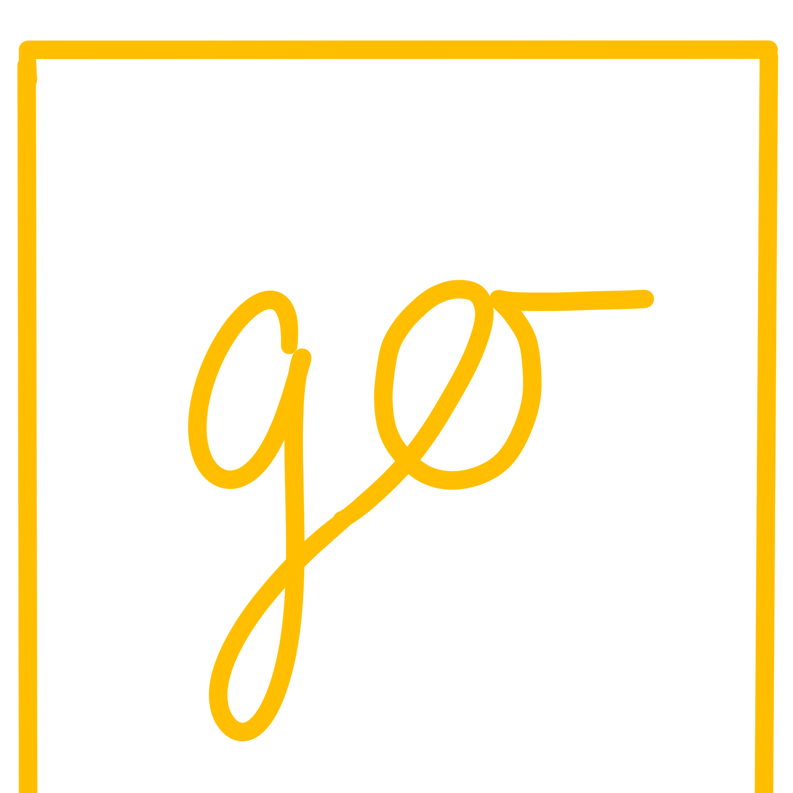

 

  

  <h1 align="center">goPage2</h1>

  

    The search on your browser homepage - with a new style
     
     
  

## Start now - Select a search engine

[**Google**](./google/index.html) - the most popular search engine

[**DuckDuckGo**](./duckduckgo/index.html) - safe and good

[**Perplexity AI**](./perplexity/index.html) - the AI search engin

[**goPage Legacy**](./original/index.html) - aka ePage (the original, using google)

 

Do you have an request for another search engine? Send me an email to [project.gopage [at] mmmarco [dot] de](mailto:project.gopage@mmmarco.de)

   

## About The Project

goPage2 is a simple browser homepage search page. It is based on the original ePage from [tbored](https://github.com/tbored)

### Built With

goPage was built with HTML, CSS & a little bit of Javascript.

  

### Hosted on

This website is hosted/deployed on Netlify

## Getting Started

To get started open goPage in a browser tab and click on the search engine you want to use. Than copy the URL of the site with the searchbar to the search engine of your choice. Then open your browser settings and set the URL to the new tab homepage URL.

## Quick Notice

You are using goPage2. This is the release version, but it is not updated fully yet.